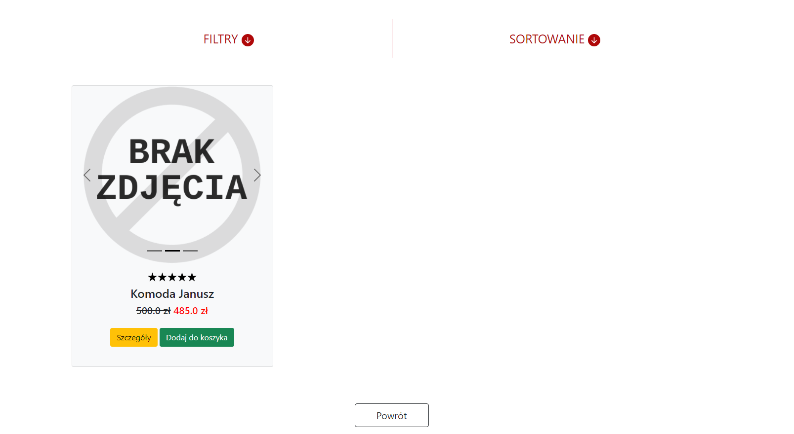

# Furniture Store


## Przegląd aplikacji

Aplikację można oglądać i testować pod poniższym linkiem:

https://furniturestore.damiancyper.repl.co/


## Opis

Furniture Store to aplikacja internetowa sklepu meblowego. Umożliwia użytkownikowi założenie konta lub zalogowanie się na istniejące konto, przeglądanie produktów dostępnych w sklepie oraz wykonywanie podstawowych operacji na produktach tj. filtrowanie i sortowanie ofert, a także może ocenić produkt i zostawić komentarz na jego temat. Klient sklepu, który posiada swoje konto może oczywiście dokonywać zakupów internetowych korzystając z płatności przy odbiorze.

W projekcie dostępny jest hierarchiczny system użytkowników - wyróżniono konto administratora, pracownika i klienta. 

- Klient ma dostęp do zakupów w sklepie internetowym, do edycji profilu, zmiany adresu, przeglądania zamówień archiwalnych i aktualnych, przeglądania i edytowania swoich opinii i ocen na temat produktów. 

- Pracownik, poza możliwościami klienta, może również przeglądać archiwum wszystkich zamówień dokonanych przez wszystkich klientów. Może również przeglądać produkty archiwalne i chwilowo nieodstępne. 
- Administrator może dodatkowo przeglądać i edytować konta wszystkich użytkowników oraz usuwać ich konta. Może również dodawać nowe produkty lub edytować istniejące. Ma również możliwość usuwania komentarzy użytkowników.

## Technologie

* Python
* Django
* SQLite


## Jak uruchomić?

Wystarczy przejść do folderu, w którym znajduje się plik manage.py i w tej lokalizacji wpisać polecenie w terminalu:

```shell
python manage.py runserver
```


## Omówienie dostępnych widoków

1. Ekran główny - widoczny po uruchomieniu aplikacji. Możemy z niego przejść do listy produktów, strony logowania i rejestracji lub strony kontaktu ze sklepem. Po zalogowaniu widzimy dodatkowo możliwość przejścia do koszyka, ustawień konta i możliwość wylogowania.

   

2. Wybór kategorii - po przejściu do przeglądu produktów widzimy stronę wyboru kategorii. Na widocznym zrzucie ekranu dostępne są tylko trzy kategorie produktów, ponieważ są to tylko dane demonstracyjne.

   

3. Widok produktów - lista wszystkich produktów z wybranej kategorii dostępnych aktualnie w ofercie sklepu. Użytkownik ma możliwość filtrowania ofert oraz sortowanie. Może również dodać interesującą go ofertę do koszyka lub przejrzeć dokładne szczegóły oferty takie jak opis, dane (wymiary, materiał wykonania) oraz przeczytać opinie innych użytkowników na temat produktu.

   

4. Strona kontaktu ze sklepem - dostępne dla użytkownika są podstawowe informacje kontaktowe takie jak adres sklepu, kontakt mailowy i telefoniczny oraz godziny otwarcia. Dostępna jest również mapa z dokładną lokalizacją sklepu oraz formularz kontaktowy (niewidoczny na poniższym screenie).

   

5. Widok ustawień konta - użytkownik, w zależności od swojej roli, może edytować różne ustawienia aplikacji. Na poniższym zrzucie ekranu widzimy stronę ustawień dla administratora.

   